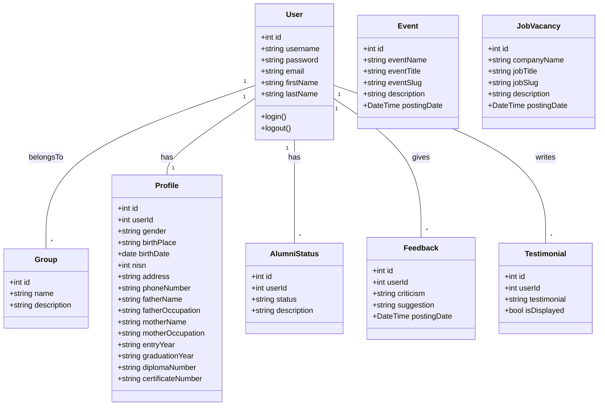

# Project Planning for Alumni Information System

## 1. Entity Relationship Diagram (ERD)

```mermaid
erDiagram
    USERS ||--o{ USERS_GROUPS : has
    GROUPS ||--o{ USERS_GROUPS : has
    USERS ||--o{ PROFILE : has
    USERS ||--o{ ALUMNI_STATUS : has
    USERS ||--o{ FEEDBACK : has
    USERS ||--o{ TESTIMONIAL : has

    USERS {
        int id PK
        varchar username
        varchar password
        varchar email
        varchar first_name
        varchar last_name
        ...
    }
    GROUPS {
        int id PK
        varchar name
        varchar description
    }
    USERS_GROUPS {
        int id PK
        int user_id FK
        int group_id FK
    }
    PROFILE {
        int id PK
        int user_id FK
        varchar gender
        varchar birth_place
        date birth_date
        int nisn
        text address
        varchar phone_number
        varchar father_name
        varchar father_occupation
        varchar mother_name
        varchar mother_occupation
        varchar entry_year
        varchar graduation_year
        varchar diploma_number
        varchar certificate_number
    }
    ALUMNI_STATUS {
        int id PK
        int user_id FK
        varchar status
        text description
    }
    FEEDBACK {
        int id PK
        int user_id FK
        text criticism
        text suggestion
        timestamp posting_date
    }
    TESTIMONIAL {
        int id PK
        int user_id FK
        text testimonial
        varchar is_displayed
    }
    EVENT {
        int id PK
        varchar event_name
        varchar event_title
        varchar event_slug
        text description
        timestamp posting_date
    }
    JOB_VACANCY {
        int id PK
        varchar company_name
        varchar job_title
        varchar job_slug
        text description
        timestamp posting_date
    }
    PROFESSION_REFERENCE {
        int id PK
        varchar profession_name
    }
    YEAR_REFERENCE {
        int id PK
        varchar reference_year
    }
    LOGIN_ATTEMPTS {
        int id PK
        varchar ip_address
        varchar login
        int time
    }
```
    }

## 2. Class Diagram



## 3. Use Case Diagram

```mermaid
usecaseDiagram
    actor Admin
    actor Member

    Admin --> (Manage Users)
    Admin --> (Manage Events)
    Admin --> (Manage Job Vacancies)
    Admin --> (Manage Feedback)
    Admin --> (Approve Testimonials)

    Member --> (Register)
    Member --> (Login)
    Member --> (Update Profile)
    Member --> (View Events)
    Member --> (View Job Vacancies)
    Member --> (Submit Feedback)
    Member --> (Submit Testimonial)
```

## 4. Additional Planning Notes

- Authentication and authorization will be role-based (admin, member).
- Admin dashboard to manage users, events, job vacancies, feedback, and testimonials.
- Members can register, login, update profiles, view events and job vacancies, and submit feedback and testimonials.
- Use reference tables for professions and years to populate dropdowns.
- Implement security features such as login attempt tracking.
- Responsive UI design for accessibility.

This planning document provides a comprehensive overview of the system architecture and user interactions to guide development.
